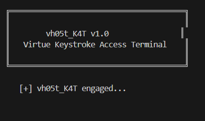

# vh05t-Keystroke-Access-Terminal

██╗   ██╗██╗  ██╗ ██████╗ ███████╗████████╗
██║   ██║██║  ██║██╔═══██╗██╔════╝╚══██╔══╝
██║   ██║███████║██║   ██║███████╗   ██║   
██║   ██║██╔══██║██║   ██║╚════██║   ██║   
╚██████╔╝██║  ██║╚██████╔╝███████║   ██║   
 ╚═════╝ ╚═╝  ╚═╝ ╚═════╝ ╚══════╝   ╚═╝   

vh05t-KAT: Ethical keystroke logger
This Python script is a keystroke logger designed for ethical and educational use. It captures user keystrokes in real time using the pynput library, buffers printable characters, and flushes them to log files with timestamps.
The script also includes an auto-flush feature that logs idle input after 5 seconds and displays a branded ASCII banner on launch. All keystrokes are saved to v1rtu3_trace.txt and v_kat_outbox.txt for review or cyber forensic purposes.
The script runs in any terminal that supports Python including Kali Linux, Ubuntu, macOS Terminal, Windows Command Prompt, and VS Code’s integrated terminal.

🔧 Setup Instructions
Clone the repository:

bash:

git clone https://github.com/v1Rtu3-h05t/vh05t-Keystroke-Access-Terminal.git

cd vh05t-Keystroke-Access-Terminal

Install dependencies (Python 3 must be installed):

bash:

pip install pynput
Run the script:

bash:

python v_kat.py

Exit cleanly while running:

🚨 Press ESC to stop the logger and flush the final buffer 🚨

📂 Output
Keystrokes are logged with timestamps to:

v1rtu3_trace.txt

v_kat_outbox.txt

## 🖼️ Demo Screenshot

